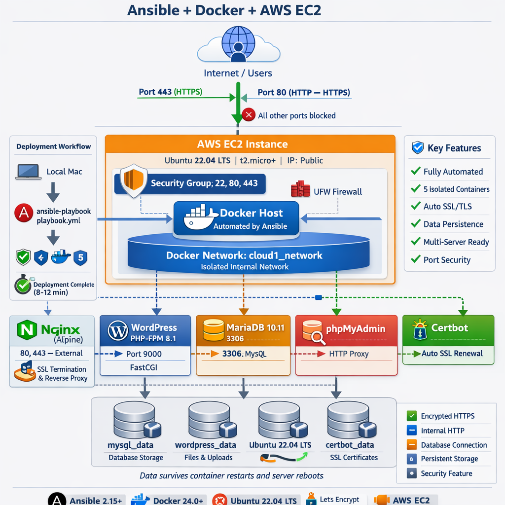

# Cloud-1: Automated WordPress Deployment on AWS EC2

[](https://www.ansible.com/)
[](https://www.docker.com/)
[](https://letsencrypt.org/)
[](https://aws.amazon.com/ec2/)

A fully automated, production-ready WordPress deployment system using Ansible, Docker, and modern DevOps practices.

**Live Demo**: https://cloud1.dev | **phpMyAdmin**: https://cloud1.dev/phpmyadmin

---
## 📸 Preview


---

## 📋 Table of Contents

- [Overview](#overview)
- [Architecture](#architecture)
- [Features](#features)
- [Project Structure](#project-structure)
- [Prerequisites](#prerequisites)
- [Quick Start](#quick-start)
- [Multi-Server Deployment](#multi-server-deployment)
- [Configuration](#configuration)
- [Security](#security)
- [Maintenance](#maintenance)
- [Troubleshooting](#troubleshooting)

---

## 🎯 Overview

**Cloud-1** automates complete WordPress stack deployment on AWS EC2 using Ansible. Each service runs in an isolated Docker container with automatic SSL/TLS certificates, persistent data storage, and comprehensive security.

### Key Features

- ✅ **One-Command Deployment**: `ansible-playbook playbook.yml` - from clean server to production
- ✅ **Container Isolation**: Each service in separate containers (1 process = 1 container)
- ✅ **Data Persistence**: All data survives container restarts and server reboots
- ✅ **Security First**: Firewall, SSL/TLS encryption, isolated database
- ✅ **Multi-Server**: Deploy to multiple servers simultaneously
- ✅ **Maintainable**: Modular Ansible roles

---

## 🏗️ Architecture
### System Overview

                                                              
                                                                     Internet                                                                                                       
                                                                        │
                                                                        │ HTTPS (443) / HTTP (80)
                                                                        │
                                                                   ┌────▼─────┐
                                                                   │   EC2    │ UFW: 22, 80, 443
                                                                   │ Instance │
                                                                   └────┬─────┘
                                                                        │
                                                    ┌───────────────────┼───────────────────┐
                                                    │    Docker Network: cloud1_network     │
                                                    │                                        │
                                                    │  ┌────────────┐    ┌──────────────┐  │
                                                    │  │   Nginx    │    │   Certbot    │  │
                                                    │  │  :80, :443 │    │  (SSL Mgmt)  │  │
                                                    │  └─────┬──────┘    └──────────────┘  │
                                                    │        │                              │
                                                    │  ┌─────▼──────┐    ┌──────────────┐  │
                                                    │  │ WordPress  │    │ phpMyAdmin   │  │
                                                    │  │ PHP-FPM    │    │   Apache     │  │
                                                    │  └─────┬──────┘    └──────┬───────┘  │
                                                    │        │                   │          │
                                                    │  ┌─────▼───────────────────▼───────┐ │
                                                    │  │      MariaDB (Internal)         │ │
                                                    │  │         Port 3306               │ │
                                                    │  └─────────────────────────────────┘ │
                                                    └────────────────────────────────────────┘


### Container Stack

| Container | Image | Purpose | Ports |
|-----------|-------|---------|-------|
| **nginx** | `nginx:alpine` | Reverse proxy, SSL termination | 80, 443 |
| **wordpress** | `wordpress:6.4-php8.1-fpm-alpine` | WordPress application | 9000 (internal) |
| **mysql** | `mariadb:10.11` | Database | 3306 (internal) |
| **phpmyadmin** | `phpmyadmin:latest` | Database GUI | 80 (internal) |
| **certbot** | `certbot/certbot:latest` | SSL automation | - |

---

## ✨ Features

### Automation
- 🤖 One-command deployment
- 🔄 Idempotent (safe to run multiple times)
- 📦 Zero manual configuration
- 🎯 Portable to any Ubuntu 22.04 instance

### Security
- 🔒 Automatic Let's Encrypt SSL/TLS with renewal
- 🔥 UFW firewall (only ports 22, 80, 443)
- 🛡️ Database isolated from internet
- 🔑 Encrypted secrets with random passwords

### Reliability
- 💾 Data persists across reboots
- 🔄 Auto-restart on failure
- ❤️ Health checks for dependencies
- 📊 Separate volumes for database/files/certificates

---

## 📁 Project Structure
```bash
cloud-1/
├── README.md # This file  
├── .gitignore # Git exclusions  
│
├── ansible/ # Ansible automation code  
│ ├── ansible.cfg # Ansible configuration  
│ ├── inventory.ini # Server inventory (single server)  
│ ├── inventory.multi.example # Example multi-server inventory  
│ ├── server_key # SSH private key (DO NOT COMMIT) => (cp downloaded ec2 key)  
│ ├── playbook.yml # Main playbook - orchestrates all roles  
│ │
│ └── roles/ # Modular Ansible roles  
│ │
│ ├── ufw/ # Firewall configuration  
│ │ └── tasks/  
│ │ └── main.yml # UFW installation and rules  
│ │
│ ├── docker/ # Docker installation  
│ │ ├── tasks/  
│ │ │ └── main.yml # Install Docker, Docker Compose, Python libs  
│ │ └── handlers/  
│ │ └── main.yml # Docker service handlers (optional)  
│ │
│ ├── deploy/ # Application deployment  
│ │ ├── tasks/  
│ │ │ └── main.yml # Create directories, copy configs, start containers
│ │ └── templates/  
│ │ ├── docker-compose.yml.j2 # Docker Compose template (Jinja2)  
│ │ └── .env.j2 # Environment variables template  
│ │
│ ├── nginx/ # Web server configuration  
│ │ ├── tasks/  
│ │ │ └── main.yml # Copy Nginx configs  
│ │ └── templates/  
│ │ ├── nginx.conf.j2 # Main Nginx config  
│ │ └── default.conf.j2 # Site-specific config (WordPress + phpMyAdmin)  
│ │
│ └── tls/ # SSL/TLS certificate management  
│ └── tasks/  
│ └── main.yml # Let's Encrypt certificate acquisition  
└── server_key  
```
### Key Files

- **`playbook.yml`**: Orchestrates all deployment roles
- **`inventory.ini`**: Defines target servers and variables
- **`roles/deploy/templates/docker-compose.yml.j2`**: Container definitions
- **`roles/nginx/templates/default.conf.j2`**: Nginx site configuration
- **`roles/tls/tasks/main.yml`**: Let's Encrypt certificate automation

---

## 🔧 Prerequisites

### Local Machine

| Tool | Version | Install |
|------|---------|---------|
| **Ansible** | 2.15+ | `brew install ansible` (macOS)<br>`pip3 install ansible` (other) |
| **Python** | 3.8+ | Pre-installed on most systems |
| **SSH** | Any | Pre-installed |

### AWS EC2 Instance

| Requirement | Specification |
|-------------|---------------|
| **Instance Type** | t2.micro or larger (1GB RAM minimum) |
| **OS** | Ubuntu 22.04 LTS |
| **Storage** | 16GB minimum (20GB recommended) |
| **Security Group** | Ports 22, 80, 443 open |

**Security Group Configuration:**

| Type | Protocol | Port | Source | Description |
|------|----------|------|--------|-------------|
| SSH | TCP | 22 | 0.0.0.0/0 | SSH access |
| HTTP | TCP | 80 | 0.0.0.0/0 | HTTP (redirects to HTTPS) |
| HTTPS | TCP | 443 | 0.0.0.0/0 | HTTPS |

### Domain Configuration

Configure DNS A records pointing to your EC2 IP:

| Type | Host | Answer | TTL |
|------|------|--------|-----|
| A | @ | YOUR_EC2_IP | 300 |
| A | www | YOUR_EC2_IP | 300 |

**Verify:**
```bash
nslookup camagru.dev
# Should return your EC2 IP
```

## Quick Start
1. Clone Repository
```Bash

git clone https://github.com/yourusername/cloud-1.git
cd cloud-1
2. Install Ansible
```

```Bash

# macOS
brew install ansible

# Ubuntu/Debian
sudo apt update && sudo apt install -y ansible

# Using pip
pip3 install ansible

# Verify
ansible --version
```

3. Configure SSH Key
```Bash

# Copy your EC2 SSH key
cp /path/to/your-key.pem ansible/server_key

# Set permissions
chmod 400 ansible/server_key
```

4. Update Inventory
```Bash
nano ansible/inventory.ini
```

**Update with your details:** 

```ini

[webservers]
cloud1 ansible_host=YOUR_EC2_IP ansible_user=ubuntu ansible_ssh_private_key_file=./server_key

[webservers:vars]
ansible_python_interpreter=/usr/bin/python3
domain_name=your-domain.com
```

5. Test Connection
```Bash
cd ansible
ansible all -m ping
```

**Expected output:**

```bash

cloud1 | SUCCESS => {
    "changed": false,
    "ping": "pong" }

```

6. Deploy
```Bash

ansible-playbook playbook.yml
```

7. Access Your Site
- WordPress: https://your-domain.com
- phpMyAdmin: https://your-domain.com/phpmyadmin


## Multi-Server Deployment

Deploy to multiple servers simultaneously for testing, staging, or production environments.

#### Method 1: Different Domains (Recommended)
Each server gets its own subdomain.

**Create** ansible/inventory.multi.example:

```ini

[webservers]
cloud1 ansible_host=54.167.107.133 ansible_user=ubuntu ansible_ssh_private_key_file=./server_key domain_name=camagru.dev
cloud2 ansible_host=54.167.107.200 ansible_user=ubuntu ansible_ssh_private_key_file=./server_key domain_name=cloud2.camagru.dev
cloud3 ansible_host=54.167.107.250 ansible_user=ubuntu ansible_ssh_private_key_file=./server_key domain_name=cloud3.camagru.dev

[webservers:vars]
ansible_python_interpreter=/usr/bin/python3
```

***DNS Configuration:***

Type  Host	    Answer	         Purpose
 A	  @	        54.167.107.133	 camagru.dev
 A	  cloud2	54.167.107.200	 cloud2.camagru.dev
 A	  cloud3	54.167.107.250	 cloud3.camagru.dev


#### Deploy:

```Bash

ansible-playbook -i inventory.multi.example playbook.yml
```

**Result:**

✅ https://camagru.dev (Server 1)
✅ https://cloud2.camagru.dev (Server 2)
✅ https://cloud3.camagru.dev (Server 3)


#### Method 2: Selective Deployment

```Bash

# Deploy only to cloud1
ansible-playbook playbook.yml --limit cloud1

# Deploy to cloud2 and cloud3
ansible-playbook playbook.yml --limit cloud2,cloud3

# Deploy to all (default)
ansible-playbook playbook.yml
```

### Architecture: Load Balanced Setup
For production with same domain:
```bash
                Load Balancer
                  camagru.dev
                      │
         ┌────────────┼────────────┐
         ▼            ▼            ▼
    Server 1      Server 2     Server 3
   (WordPress)   (WordPress)  (WordPress)
```

### Check Status

```Bash

# SSH to server
ssh -i ansible/server_key ubuntu@YOUR_EC2_IP

# View running containers
docker ps

# Check specific container
docker logs cloud1_nginx
docker logs cloud1_wordpress
docker logs cloud1_mysql
```

### Restart Services

```Bash

# On server
cd /opt/cloud1

# Restart single service
docker-compose restart nginx

# Restart all
docker-compose restart
```
---  
## 📸 Preview

